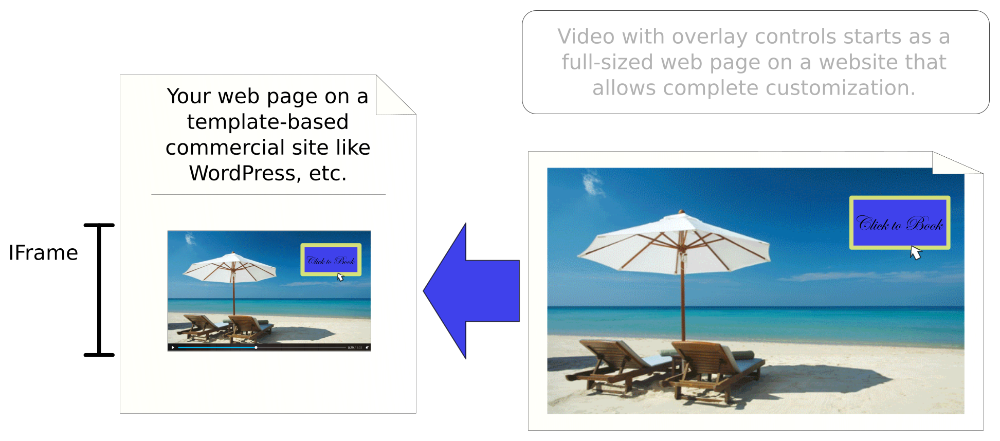
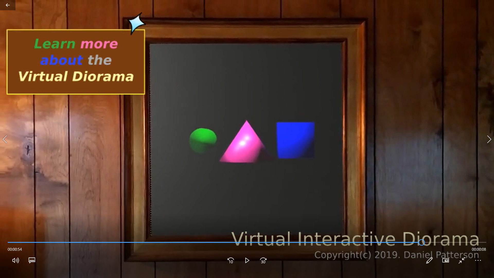
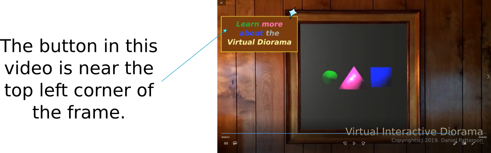
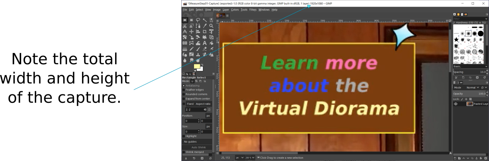
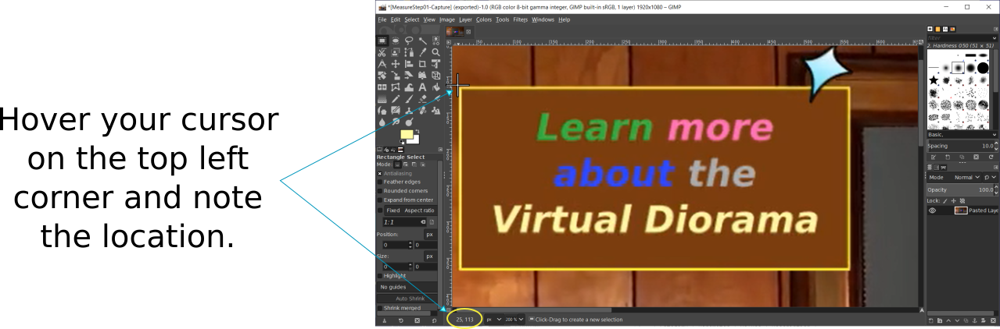
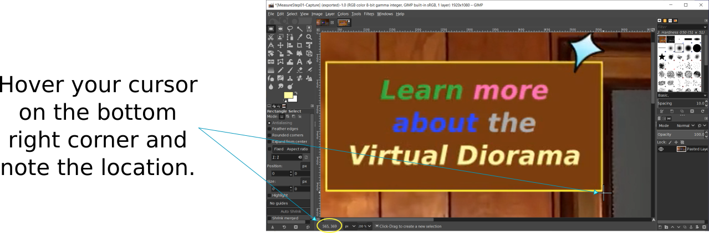

# Embedded Video Player With YouTube-Style Hotspot Link

HTML5 allows the direct inclusion of a video with controls into any web page. However, a little bit of additional work is needed to place interactive overlays on the screen above the video, especially in cases when you are using a template-driven website like WordPress, Wix, Sites, or others that don't allow direct customization of the underlying HTML code.

To work around that obstacle, a combination video player and overlay control, hosted on another site that does support cusomization, is embedded in the intended web page using an iframe, an HTML container component specialized just for that type of purpose.

In the example at the bottom of this page, an &lt;iframe&gt; element is used to display a basic movie with a clickable overlay control, enabled at 53 seconds, and embedded into the intended web page.

In the current version, the clickable overlay only supports a link to another page that opens in a new tab, and it only provides a transparent hotspot for that link. This means you will need to provide your own formatted button image in the video you intend to highlight. To help with positioning the hotspot over your button image, though, you can turn on the hot spot indicator to highlight the full area sensitive to your button click.
  

## Getting Started

To use the embedded iframe control, set its <b>width</b> and <b>height</b> attributes to the width and height to be displayed on the host web page, then follow these instructions to set the value of the <b>src</b> attribute to load the video and control the hotspot card.
  

### Filling The IFRAME SRC Attribute
Start with the full https path to the video player page, followed by a question mark to indicating that parameters are included.

For example:
<blockquote>
<b>https://www.mydomain.com/VideoPlayer.html?</b>(Parameters will go here)
</blockquote>

Next, add all of the appropriate parameters from the reference list below, using this general syntax:
<blockquote>
{ParameterName}<b>=</b>{ParameterValue}<b>&amp; ...</b>
</blockquote>

For example:
<blockquote>
src=&quot;VideoPlayer.html?showHotspot=1&amp;video=GreatVideo.mp4&amp;buttonTime=53&quot;
</blockquote>
  

### About Video Frame Size
In the following reference table, several values are described as being a percentage of the current video frame size, which refers to the characteristic that it is possible for the video to be placed into a frame of any size, that in certain cases, can be sized in response to the current browser resolution and might also be resizable in real time by the current viewer, depending upon the settings of the page upon which it is shown.

To easily address the variability in display size, most of the parameters in the layout category are references to percentage of the current display size of the video frame.

The following steps help to calculate the positioning and size of the button, relative to the video.

 1. Open the video you are going to display and run it in full screen.
 2. Index to the time at which the button is displayed and stop the video.
 3. Press the \[PrtScr\] button on your keyboard to copy the screen content to the clipboard.
 
 4. Open GIMP or some other bitmap editor that allows you to to review your cursor position.
 5. Paste the captured image into your editor.
 
 6. Note the width and height of the captured frame. For this example, FrameWidth = 1920 and FrameHeight = 1080.
 
 7. Hover your cursor over the top left corner and note the location. In this example, LeftX = 25 and TopY = 113.
 
 8. Hover your cursor over the bottom right corner and note the location. In this example, RightX = 565 and BottomY = 369.
 

Using the values assumed for this example, the following calculations are used for highlighting this button in the top left quadrant.
 - buttonTop = (TopY / FrameHeight) * 100 = (113 / 1080) * 100 ~ 10.463
 - buttonLeft = (LeftX / FrameWidth) * 100 = (25 / 1920) * 100 ~ 1.302
 - buttonWidth = ((RightX - LeftX) / FrameWidth) * 100 = ((565 - 25) / 1920) * 100 = 28.125
 - buttonHeight = ((BottomX - TopX) / FrameHeight) * 100 = ((369 - 113) / 1080) * 100 ~ 23.704
 

### SRC Parameter Reference
To be as general-purpose as possible, and completely reusable for different videos, the video player control takes a number of parameters, each of which are described in the following table.

| Category | Parameter | Values | Description |
|----------|-----------|--------|-------------|
| Layout | buttonTop | Optional. Decimal | Distance of the button from the top of the video, in percentage of current video frame size. This parameter is mutually exclusive with buttonBottom. |
|   | buttonBottom | Optional. Decimal | Distance of the button from the bottom of the video, in percentage of current video frame size. This parameter is mutually exclusive with buttonTop. |
|   | buttonLeft | Optional. Decimal | Distance of the button from the left side of the video, in percentage of current video frame size. This parameter is mutually exclusive with buttonRight. |
|   | buttonRight | Optional. Decimal | Distance of the button from the right side of the video, in percentage of current video frame size. This parameter is mutually exclusive with buttonLeft. |
|   | buttonWidth | Decimal | The width of the button, in percentage of current video frame size. |
|   | buttonHeight | Decimal | The height of the button, in percentage of current video frame size. |
|   | showHotspot | 0 or 1 | 1 to show a box where the hotspot where the click will be expected. Otherwise, 0 to hide it. |
| Timing | buttonTime | Integer | Total number of seconds at which the button becomes available. |
| Source | video | String | Filename of the video. In this version, the video is expected to be located in the videos subfolder, and the parameter name is specified without any folder names. |
| Interaction | target | URL Encoded String | The url of the target page to load when the overlay button has been clicked. This value must be URL encoded. To manually encode the click target link, visit  https://www.urlencoder.org/ and click Encode. |
  

### Completed IFRAME
Following is an example of the fully-filled iframe reference used for the demo at the end of this page.

<blockquote>
&lt;iframe width=&quot;960&quot; height=&quot;540&quot;
src="https://danielanywhere.github.io/VideoPlayer.html?showHotspot=0&amp;video=ForcedPerspective-2019051303.mp4&amp;buttonTime=53&amp;buttonLeft=1.302&amp;buttonTop=10.463&amp;buttonWidth=28.125&amp;buttonHeight=23.704&amp;target=TestTarget.html"&gt;&lt;/iframe&gt;
</blockquote>

## Demo
Following is a link to the demo video with a clickable button that appears at 53 seconds.

<iframe width="700" height="394"
src="https://danielanywhere.github.io/VideoPlayer.html?showHotspot=0&video=ForcedPerspective-2019051303.mp4&buttonTime=53&buttonLeft=1.302&buttonTop=10.463&buttonWidth=28.125&buttonHeight=23.704&target=TestTarget.html"></iframe>

